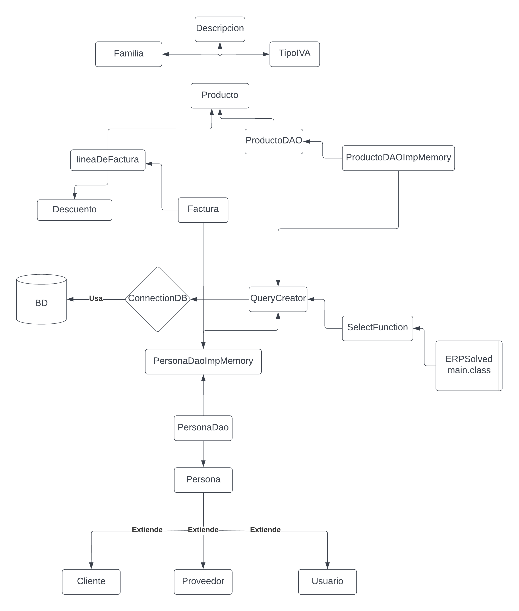
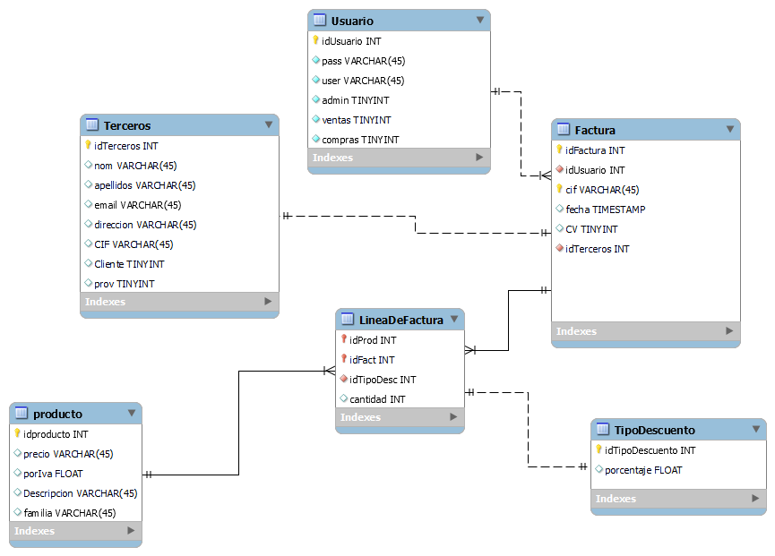
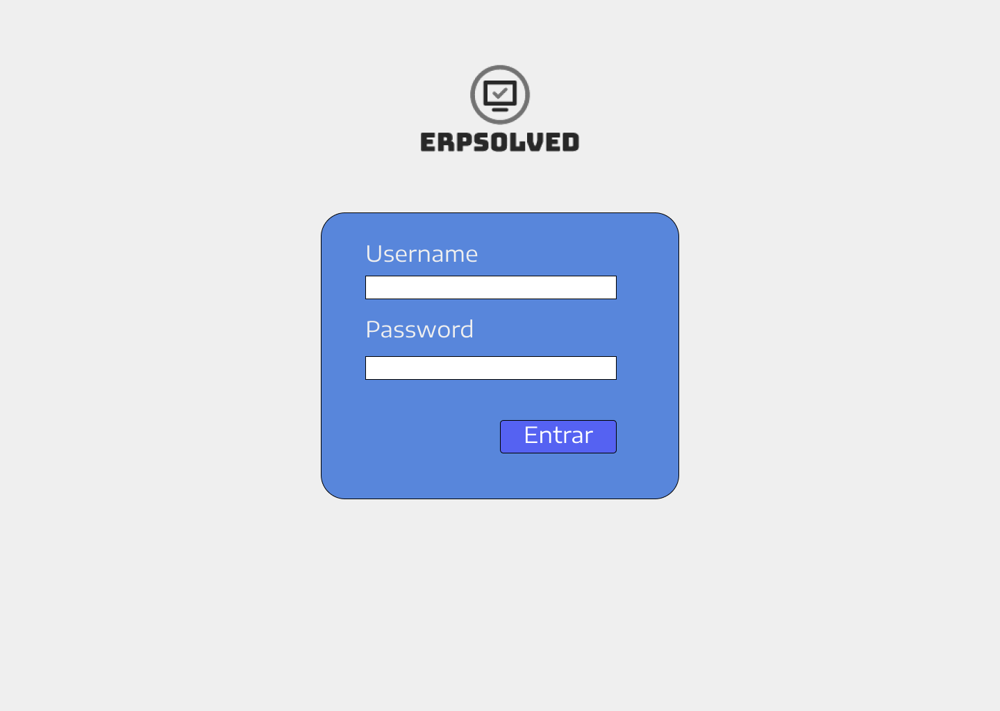
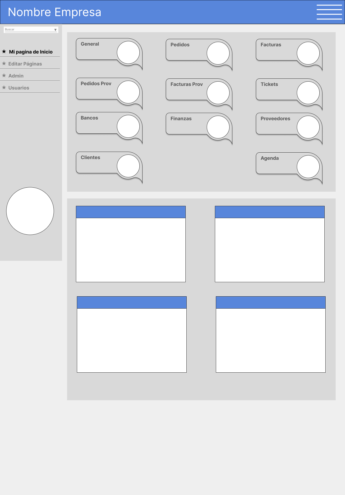
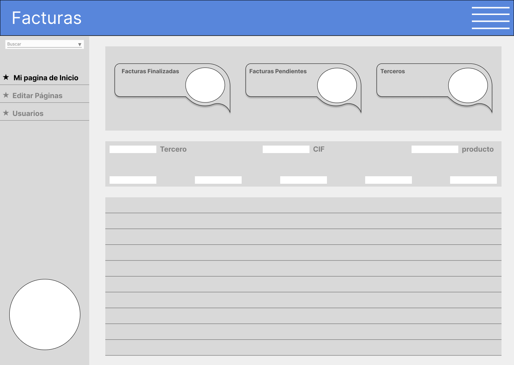
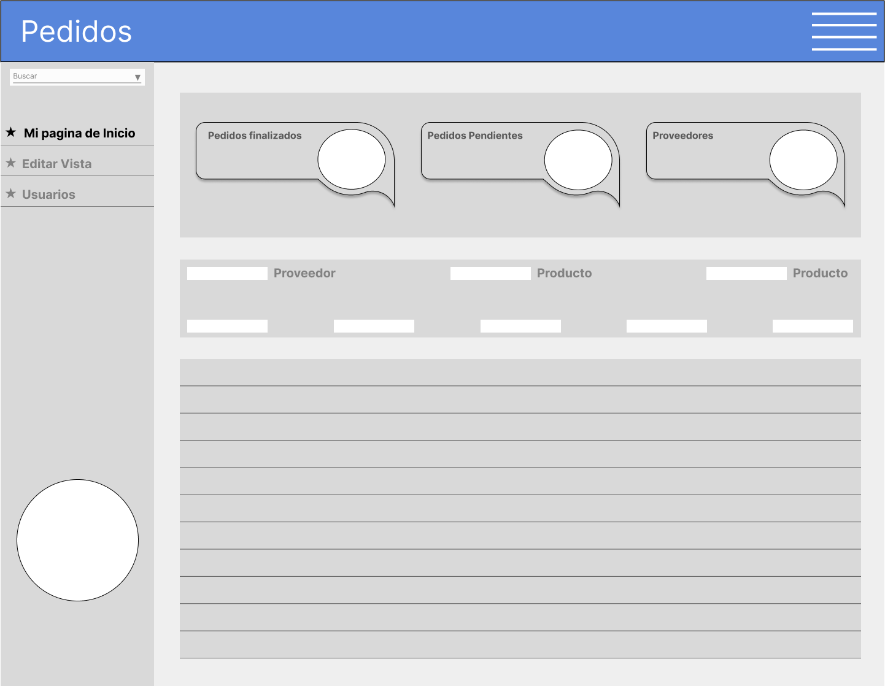
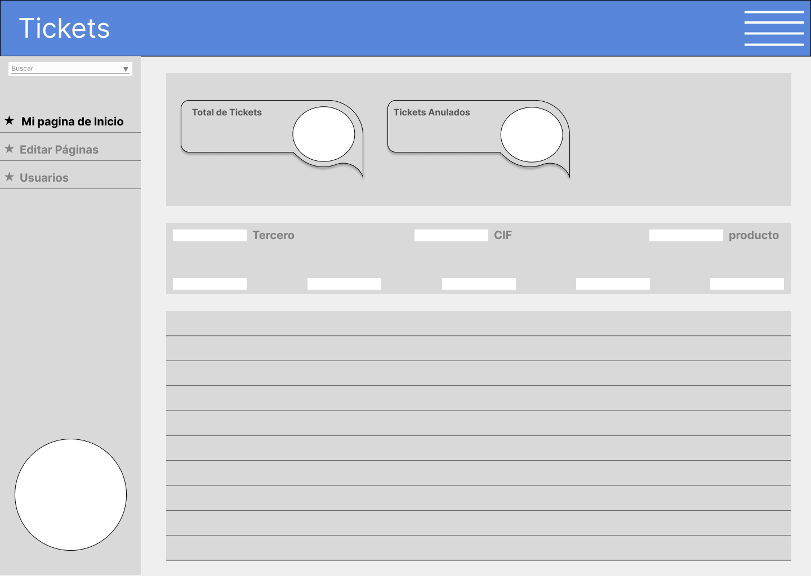
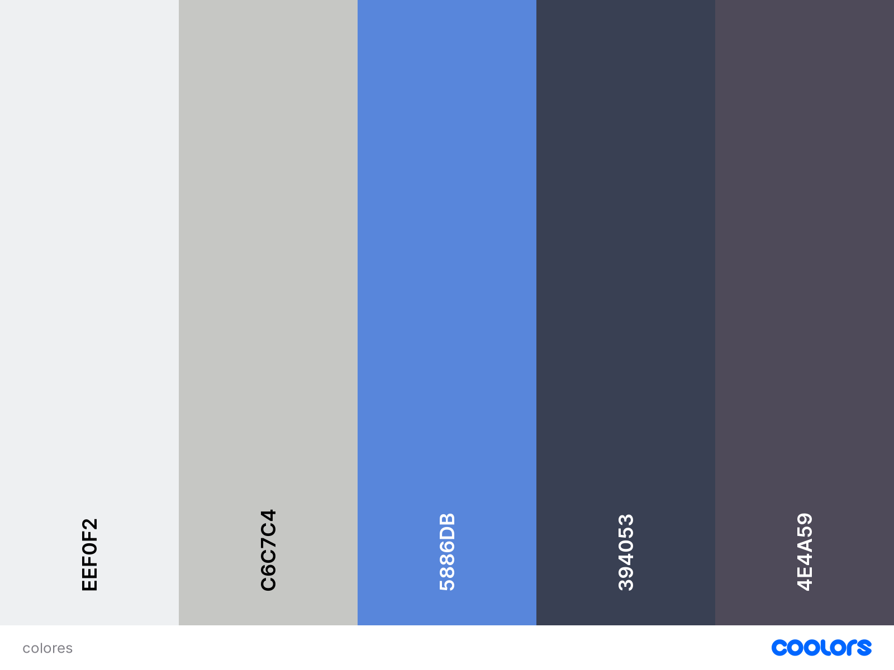

# ERPSolved
implemento un ERP con Spring Boot
## Introduccion

Para ejecucion, necesitas descargar redis con docker y tener una base de datos mySQL en elpuerto por defecto configurarlo en el puerto  __9090__ 

Una vez preparada la bd y el redis, ejecutaremos el programa para que se creen las tablas en la BD
y por ultimo ejecutaremos los .sql que hay en la carpeta "BD", principalmente el de __mydb_uusuario_entity.sql__ ya que sera la que cargue los usuarios por primera vez.

*TIP*:  En la ejecucion del programa SpringBoot, se muestra en la consola, la ultima linea,
lo que seria el ByCrypt de 1234, y si insertas el usuario a mano en la bd con los roles correspondientes, solo tinenes que copiar y pegar y la contraseña seria _1234_

Acceder al login:

 __Como usuarios__ --------------------------------------- __Como Admin__ 
 
__username__:   *jorpelu*_______________________________________ *admin*  
__password__: *1234* _________________________________________ *1234*  

  

## Clases

### Clases a implementar:
    Empleado                            
    Persona
        - Cliente               
        - Proveedor
    Producto
    Agenda
    Finanzas
        - Banco
        - Factura
        - Nomina
        - Contabilidad

## Diagrama de Clases
*deprecated*

 

## Diagrama de Entidad-Relación

  

## IU Capturas de pantalla
*Deprecated*

## Paleta de colores

    $cultured: #eef0f2ff;
    $silver: #c6c7c4ff;
    $united-nations-blue: #5886dbff;
    $independence: #394053ff;
    $dark-liver: #4e4a59ff;

